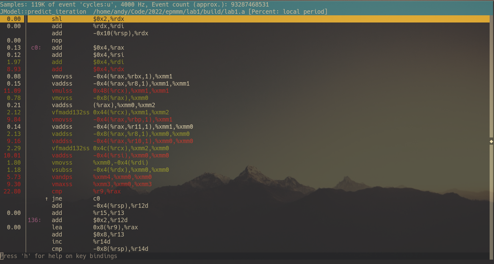
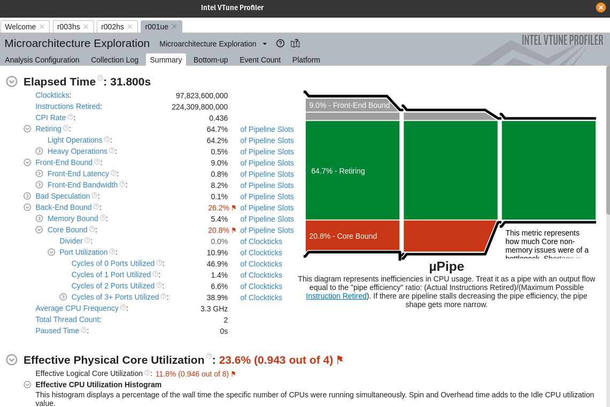
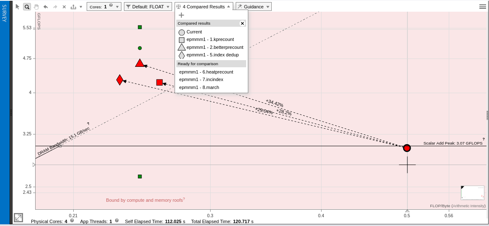
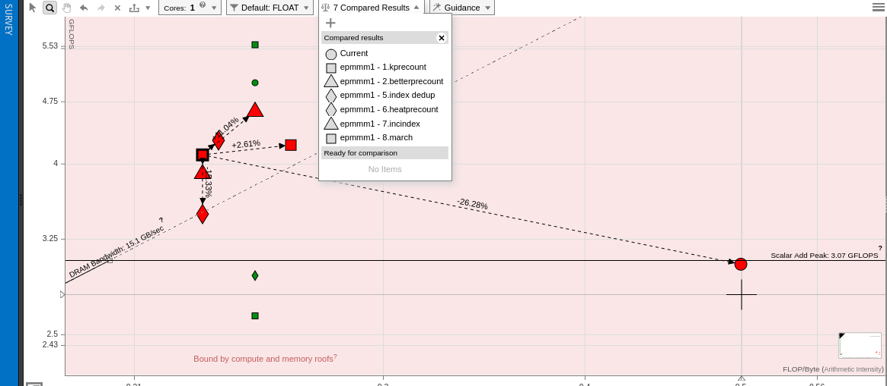

# Optimisations report

## Задачи

1. Разработать программу, проверить правильность работы.
2. Базовая оптимизация программы - компилятором и вручную, измерение времени работы после каждой оптимизации.
3. Для наиболее оптимизированной версии:
    1. Построить граф вызовов, найти "горячие точки" с точностью до функций.  
    2. Построить аннотированный листинг, определить «горячие точки» программы с точностью до строк исходного кода и машинных команд.   
    3. Получить c помощью профилирования:
        1. среднее число тактов на микрооперацию (или микроопераций на такт)
        2. процент кэш-промахов для кэшей первого и последнего уровней
        3. процент неправильно предсказанных переходов
    4. Сделать предположение о том, что является основной причиной временных затрат (вычислительные операции, обращения в память выполнение команд перехода, …). 

  
## 1. Environment

- task: `Jacobi method` using `float`s
- input params  : 10000 10000 100
- time measuring: average of 10 samples  
on i7-4712MQ  
with running docker, containerd, postgres daemons (лениво отключать было)  

каждой следующей оптимизации соответствует отдельный коммит в репозитории - для удобства сравнения


## 2. Optimisation times
- reference     :  1010 s
- reference + 01:   116 s
- reference + O2: 112.5 s
- k precount    :    49 s
- betterprecount:    46 s
- grouping      :  48.5 s
- array decoup  :  50.5 s
- row decoup    : scrapped
- index dedup   :    46 s
- heat precount :    35 s
- inc index     :    33 s
- march=native  :  27.5 s
- affinity      : 33.5 vs 33.52 s*

## 2. Optimisation descriptions

### 1. k precount:

Предвычислил 4 коэффициента при слагаемых при инициализации, поскольку они не меняются.

### 2. better precount:

Исключил остальные умножения в коэффициентах.

### 3. Memory access grouping

Группировка запросов к данным на одной строке матрицы;  
*неудачные +2.5s*

### 4. Array cycle decoupling

1 цикл -> 2, по heat_sources и по current_model - локализация запросов  
*еще +2s, откат к 2*

### Row cycle decoupling

1 цикл -> 3, строчка выше, эта, ниже - дополнительная локализация  
*идея отменена в силу невыгодности на основании предыдущих*

### 5. Index deduplication

Индекс вычисляется один раз за итерацию, вместо 14 в инлайн-варианте  
*никакой разницы с 3, откат с целью читаемости*

### 6. heat pre-count

Предподсчет хвоста от источников, поскольку тот статичен.  
*Спорно, базовая ли это оптимизация*,   
К тому же требует в самом начале еще одного массива на короткое время,  
но можем воспользоваться current_model для инициализации и затем подменить указатели аналогично `JModel::switch_models()`.

### 7. Incremental indexes

Вместе с оптимизацией 5., вместо перевычисления индекса каждую итерацию с умножением - только суммирование.

### 8. march=native

Совсем забыл про оптимизацию под архитектуру, к сожалению - выигрыш заметен.

### 9. core affinity

Фиксируем core affinity на, например, первое ядро.
*Похоже, линковка lpthread нивелирует весь выигрыш от предыдущей оптимизации;*  
*Однако, если сравнивать с 7 версией при том же Makefile,*  
есть скромный выигрыш в 2 сотых секунды на среднем от выборки из 20*  

## 3. Profiling

### 3.1 Call graph
```
    $ make jprof
    $ ../scripts/20times.sh
    $ make jcalls
```


### 3.1 default gcc (O0) flags call graph
```
    $ make jprof0
    $ ../build/lab1pg0 10000 10000 20
    $ make jcalls0
```


### 3.2 Annotated listing


Можно заметить, что т.к. почти все команды с суффиксом `ss`, т.к. `scalar single-precision float`, то векторизации не произошло.



### 3.3 Profiling

```
[andy: Code/2022/epmmm/lab1]$ perf stat ./build/lab1.a 10000 10000 100
JInput: Nx=10000, Ny=10000, T=100
Time to predict: 27.5118 s
Success! Go check .png

 Performance counter stats for './build/lab1.a 10000 10000 100':

         28,450.99 msec task-clock:u              #    0.971 CPUs utilized
                 0      context-switches:u        #    0.000 /sec
                 0      cpu-migrations:u          #    0.000 /sec
           390,719      page-faults:u             #   13.733 K/sec
    90,264,992,824      cycles:u                  #    3.173 GHz
   223,215,517,466      instructions:u            #    2.47  insn per cycle
    10,298,885,850      branches:u                #  361.987 M/sec
         1,046,741      branch-misses:u           #    0.01% of all branches

      29.292790496 seconds time elapsed

      27.667065000 seconds user
       0.697494000 seconds sys
```

```
[andy: Code/2022/epmmm/lab1]$ perf stat     \
    -e L1-dcache-load-misses,L1-dcache-loads \
     ./build/lab1.a 10000 10000 100
JInput: Nx=10000, Ny=10000, T=100
Time to predict: 27.518 s
Success! Go check .png

 Performance counter stats for './build/lab1.a 10000 10000 100':

     3,140,692,232      L1-dcache-load-misses:u   #    2.40% of all L1-dcache accesses
   131,054,578,578      L1-dcache-loads:u

      29.335323215 seconds time elapsed

      27.770801000 seconds user
       0.694176000 seconds sys
```
 
```
[andy: Code/2022/epmmm/lab1]$ perf stat \
    -e LLC-load-misses,LLC-loads    \
    ./build/lab1.a 10000 10000 100
JInput: Nx=10000, Ny=10000, T=100
Time to predict: 27.6472 s
Success! Go check .png

 Performance counter stats for './build/lab1.a 10000 10000 100':

        28,533,259      LLC-load-misses:u         #   25.76% of all LL-cache accesses
       110,759,502      LLC-loads:u

      29.640592112 seconds time elapsed

      27.882727000 seconds user
       0.681865000 seconds sys

```

- instructions:u            #    2.47  insn per cycle
- L1-dcache-load-misses:u   #    2.40% of all L1-dcache accesses
- LLC-load-misses:u         #   25.76% of all LL-cache accesses
- branch-misses:u           #    0.01% of all branches

Теоретический лимит для моего процессора - 4 insn per cycle из-за количества декодеров.
(https://en.wikichip.org/wiki/intel/microarchitectures/haswell_(client)#Block_Diagram)

### 3.4.1 mPipe 



### 3.4.2 Roofline

Построим *roofline* для всех проведенных этапов оптимизации в `intel vtune`.  
Из очевидных результатов - рост производительности и уменьшение вычислительной сложности после 1 оптимизации,  
для всех последующих результат похож на погрешность от профилирования.  
Дополнительная нечистота эксперимента - программы собирались младшей версией компилятора - `9` вместо `11.2.0`, поскольку `vtune` был установлен на другом дистрибутиве, `ubuntu 20`.  




### 3.4 Вывод

- по `roofline` четко можно разделить изначальную программу с -O2 и группу оптимизаций, 
уменьшившую арифметическую интенсивность и поднявшую производительность.
- на моей машине программа core-bound, судя по отчетам `vtune`, из-за дисбаланса по портам (см. 3.4.1)
- 2.47 инструкций за цикл - хороший показатель, при теоретических 4 - в Haswell 4-канальный декодер:  
(https://en.wikichip.org/wiki/intel/microarchitectures/haswell_(client)#Block_Diagram)
- неудачные оптимизации по памяти подтвердили, что выигрыш при чтении из памяти будет компенсирован проигрышем при записи и работе с кэшем
- поскольку компилятор не векторизовал вычисления, следующей логичной оптимизацией будет векторизация

Исходники и коммиты с оптимизациями:  
[https://github.com/UltimateHikari/epmmm]
