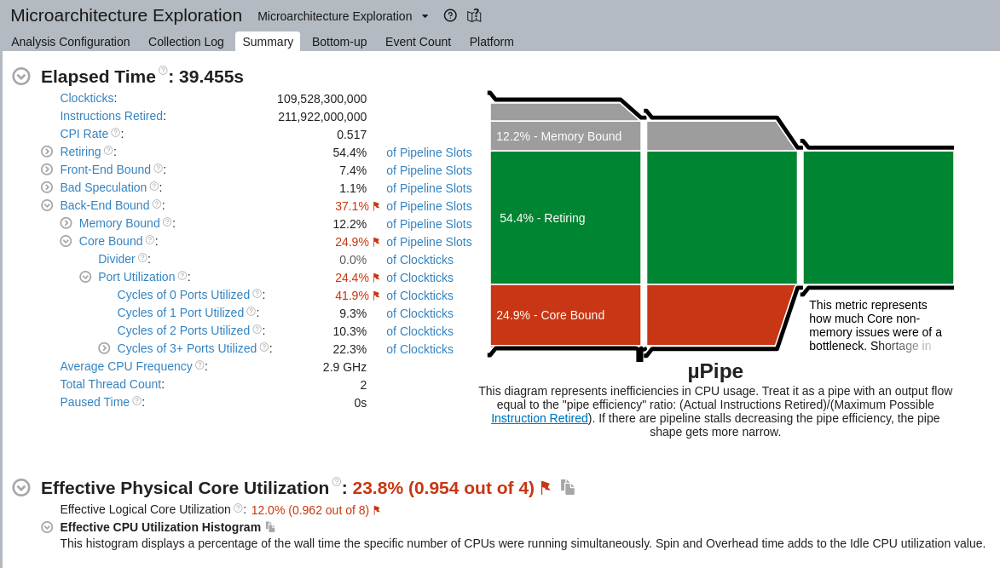

# Optimizations report 3

## Задачи

1. Реорганизовать программу из лабораторной 2:
    1. Чтобы за 1 проход вычислялось K итераций
    2. Подобрать K для наибольшего ускорения
2. Проанализировать производительность лучшего варианта аналогично лабораторной 1
    1. Построить roofline 
    2. Сравнить производительность

## 0. Environment

- task: `Jacobi method` using `float`s
- input params  : 10000 10000 100
- time measuring: least of 10 samples, **average per 10 iterations**
- CPU: i7-4712MQ  
- Compiler: GNU GCC 11.2.0
- other load on cpu: docker, containerd, postgres daemons

каждой следующей оптимизации соответствует отдельный коммит в репозитории - для удобства сравнения

## 1. Optimisation times

- reference (лаб.2)     : 1.02s (10.2s per 100)  
- оптимальное K = 14,26     : 0.844s (8.44s per 100)  
График в зависимости от K - среднее время на 10 итераций:  

## 1. Optimisation descriptions

### 1.0 K-ladder
Вычисления построчно "лесенкой", т.е. опираясь на 3 уже лежащих в кэше значения.  
K - "высота" лесенки, т.е. сколько итераций за раз считается.  
Количество итераций подбиралось делящееся на K, а K четное,  
и для сравнения - напоминаю - бралось **среднее время на 10 итераций**

## 2. Анализ

### 2.0 mpipe & perf

### 2.1 roofline

## Вывод

Во 2 лабораторной узким местом было обращение в память вместо использования кэша,  
вышеописанная оптимизация позволила лучше использовать L3 кэш,  
кэши более высоких уровней вряд ли получится использовать при таких больших размерах строк без разрезания оных.  
Время работы программы улучшилось.  
Оптимальное скорее всего K=14, K=26 выглядит аномалией, все что больше точно вредно.
